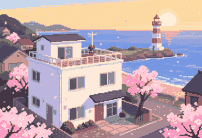

# Shared Roof

A slow, top-down pixel-art life-sim inspired by quiet share-house reality TV. You move into a seaside house with five
strangers, cook, go out in the city, fall for someone (or don't), and leave the house alone, as a couple, or after a
confession that went wrong. A studio panel of five commentators watches everything and makes predictions.

- **Local-first.** `npm run dev:mock` runs the whole game with no external services: dialogue, commentary and images
  come from deterministic templates and procedural pixel art.
- **Real mode** uses your own machine: [Ollama](https://ollama.com) for dialogue (Gemma by default) and
  [ComfyUI](https://github.com/comfyanonymous/ComfyUI) for pixel-art portraits, backgrounds and freeze-frames.
- **Living world.** The five housemates are agents with needs, goals, secrets, beliefs and schedules. They gossip,
  fall in love, fight and leave whether or not you're in the room.
- All characters are fictional adults (20+). Content rating PG-13.



## Quick start (mock mode, no services)

Requires Node.js 20+ (tested on 24).

```bash
npm install
npm run dev:mock
```

Open http://localhost:5173. That's it.

## Real mode (Ollama + ComfyUI)

1. **Ollama** — install from https://ollama.com, then pull a model:

   ```bash
   ollama pull gemma3:12b
   ```

   Smaller models work too (`gemma3:4b`): prompts are compact and schemas small. Any chat model Ollama can serve with
   JSON-schema output will do; set `OLLAMA_MODEL`.

2. **ComfyUI** — install and start ComfyUI (the Windows portable build is fine). The default workflow uses Qwen-Image +
   the Lightning 8-step LoRA. See [docs/COMFYUI.md](docs/COMFYUI.md) for the model files, how to import or export
   your own workflow, and how `workflows/mapping.json` works.

3. **Configure** — copy `.env.example` to `.env` and adjust:

   ```bash
   cp .env.example .env
   ```

   | key | default | meaning |
   |---|---|---|
   | `MODE` | `real` | `real` or `mock` (`dev:mock` forces mock) |
   | `OLLAMA_URL` / `OLLAMA_MODEL` | `http://127.0.0.1:11434` / `gemma3:12b` | text model |
   | `COMFY_URL` / `COMFY_WORKFLOW` / `COMFY_MAPPING` | `http://127.0.0.1:8188` / `./workflows/…` | image backend |
   | `IMAGE_STYLE_PREFIX` | pixel art … | prepended to every image prompt |
   | `SEASON_LENGTH` | `24` | episodes per season |
   | `LLM_CALLS_PER_SLOT` | `6` | hard cap of LLM calls per time slot; the rest uses templates |
   | `SEED` | random | fixed seed for reproducible seasons |
   | `PORT` | `8787` | API port (the web dev server proxies to it) |

4. **Run**

   ```bash
   npm run dev
   ```

   The title screen shows which services are up. If Ollama or ComfyUI are down, the game keeps working: each call
   falls back to templates or placeholders and an "images offline" / "templates" badge appears.

5. **Smoke test** (one dialogue, one commentary, one image against your services):

   ```bash
   npm run smoke
   ```

Tip: on a single 16 GB GPU, ComfyUI and a 12B model compete for VRAM. Scenes still stream, just slower; a 4B model or
leaving ComfyUI idle makes dialogue near-instant.

## How to play

- **House** — walk with arrow keys / WASD, press **E** next to someone to talk or next to the stove, sofa, rooftop
  bench, fridge or front door. Everything is also in the action list on the right.
- **Slots** — every episode is morning → three daytime slots → evening. Each choice uses one slot. The world advances
  either way; a "while you were out" digest tells you what you heard (witnessed / told / rumor).
- **City** — during the day, go out: dates, wandering, part-time shifts, karaoke. Far spots need the shared car.
- **Scenes** — dialogue streams in; at your moment, pick an intent (be honest, flirt, joke, support…). Your character
  says it in their own voice. You can join, eavesdrop on, or ignore conversations you walk into.
- **Cooking** — chop to the beat, boil, keep the pan in the band, season by taste, plate like the photo. Who you feed,
  and what they like, matters. There's a practice kitchen on the title screen.
- **Phone, board, bible, fridge** — `P`, `B`, `I`, `F`. The relationship board only shows what you know, and how you
  know it.

## Scripts

| command | what it does |
|---|---|
| `npm run dev:mock` / `npm run dev` | server + web in mock / real mode |
| `npm test` | all tests (includes the 200-seed season simulation, ~3 min) |
| `npm run test:e2e` | browser end-to-end tests (Playwright on the system Edge; builds the web app, mock-mode server on a throwaway data dir; 5 tests, ~15 s) |
| `npm run typecheck` / `npm run lint` | TypeScript (strict) and ESLint |
| `npm run build` | typecheck + production web build (`npm start` serves it with the API on `PORT`) |
| `npm run smoke` | real-service smoke test |
| `npm run replay -- <saveId>` | deterministic replay of a save's event log (lists saves without an id) |
| `npm run sim -- <seed> [idle\|active] [random]` | headless season run with a summary |

Faster test loop: `SIM_SEEDS=20 npm test`.

## Architecture

```
web (React, Zustand, Tailwind, canvas)  <-- HTTP + SSE -->  server (Fastify)
                                                             ├─ engine (packages/shared, pure + deterministic)
                                                             ├─ director / agents / knowledge / arcs (engine)
                                                             ├─ llm: ollama | mock     (structured calls + fallback)
                                                             ├─ images: comfyui | mock (priority queue + disk cache)
                                                             └─ sqlite: saves, memories, images, events_log
```

- `packages/shared` — zod model, seeded RNG (mulberry32), content loader, the whole engine, mock text generators,
  pixel-art generators. No I/O. Every state transition is `(state, action) → state` with randomness from
  `state.rngState`, so seasons replay exactly.
- `apps/server` — adapters, prompt builders (`src/prompts/*.ts`), generation service with voice checks and budget,
  game session, SSE scene streaming, image queue, persistence.
- `apps/web` — screens, procedural top-down renderer (house, city, sprites), cooking minigame renderer.
- `content/` — cast, archetypes, arcs, events, city, recipes, panel, quirks, recurring NPCs, house layout, calendar.

The LLM never touches game state: it proposes deltas, the engine validates them with zod, clamps every delta to ±15
and only applies ids that exist. Characters only "know" facts in their knowledge set; prompts never include facts a
speaker doesn't know.

See [DECISIONS.md](DECISIONS.md) for design choices and [PROGRESS.md](PROGRESS.md) for milestone status.

## Known limitations

- Dialogue in real mode is only as good (and fast) as the local model; with the default budget of 6 calls per slot,
  NPC-only scenes beyond the first are template-written.
- Images: the default workflow targets Qwen-Image; other models need a workflow export and a `mapping.json` edit.
  Freeze-frames keep the lead character's face through a Qwen-Image-Edit reference workflow (one reference face per
  image); portraits and backgrounds rely on fixed seeds and tag order.
- One GPU for both services: while dialogue streams the image queue waits and ComfyUI's models are unloaded, so the
  next image pays a model reload. A smaller model (`OLLAMA_MODEL=gemma3:4b`) makes first lines near-instant.
- English only (`LANGUAGE` is reserved).
- The pixel world is procedural and intentionally simple: no pathfinding animation between rooms beyond tweening,
  no in-house cut-scenes.
- Single local player, single active game per server process.
